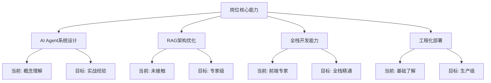

# 2026年AI Agent全栈工程师岗位分析与个人差距评估

## 📊 目标岗位分析

### 岗位基本信息
- **公司**：中硅星云科技(广州)有限公司
- **岗位**：资深全栈工程师（AI Agent方向）
- **薪资范围**：12-24K
- **地点**：广州白云区（支持远程/弹性协作）

### 团队背景
> "我们是国内首批聚焦垂直领域AI Agent落地的技术驱动型初创团队，核心成员均来自头部科技企业AI研发部门，在大模型应用、智能体架构搭建等领域拥有深厚技术积累与丰富实战经验。"

### 核心任务要求

#### 1. AI Agent架构设计与落地
- 基于LangChain、LlamaIndex或大模型原生API
- 实现自反思（Reflection）、多步骤规划（Planning）、复杂工具调用（Tool Use）能力
- 支撑复杂业务场景下的自主任务闭环

#### 2. 长短期记忆与RAG架构优化
- 向量数据库（Pinecone/Milvus等）选型、部署与调优
- 优化RAG架构的知识检索、召回与排序策略
- 解决复杂上下文、多轮对话中的知识混淆问题

#### 3. 后端工程化与性能保障
- 设计高性能AI服务API
- 容器化部署（Docker）与CI/CD流水线搭建
- 保障系统在高并发场景下的稳定性

#### 4. 全链路产品化迭代
- 主导从模型调优、Agent能力打磨到前端交互的全链路开发
- 快速将AI能力转化为可落地的产品功能

## 🔍 技术要求深度分析

### AI技术深度要求
1. **大模型精通**：
   - GPT-4、Claude 3.5、Gemini 1.5 Pro等主流大模型
   - API调用策略、能力边界理解
   - 模型选型与适配能力

2. **Prompt工程专家**：
   - Function Calling、JSON Mode、结构化输出
   - 通过Prompt设计实现复杂任务精准执行
   - LLM微调、对齐等调优技巧

3. **AI Agent系统经验**：
   - 独立搭建并落地AI Agent系统
   - 多智能体协作、任务执行结果校验
   - 自我迭代机制实现

### 全栈开发能力要求
1. **后端语言**：Node.js/Python/Go至少一种（精通）
2. **前端技术**：Flutter跨端开发
3. **工程化能力**：
   - Docker容器化部署
   - Kubernetes集群管理
   - 高并发服务设计

### 极客特质与技术敏感度
1. **AI工具深度用户**：
   - 日常工作流高度AI化（Cursor/GitHub Copilot等）
   - 开发效率提升实践

2. **前沿技术跟踪**：
   - AI顶会论文（ICML、NeurIPS等）关注
   - 开源项目（AutoGPT、CrewAI等）动态
   - 快速将新技术融入产品研发

## 📈 个人技术差距评估

### 当前优势（前端开发9年经验）
1. **前端技术扎实**：
   - Vue、React、TypeScript、Webpack、Taro
   - 多平台开发（小程序、H5、React Native）
   - 项目从0到1主导经验

2. **管理经验丰富**：
   - 两年前端管理经验
   - 技术团队建设参与
   - 项目管理能力

3. **学习能力验证**：
   - 已自学Rust、EVM/Solana智能合约开发
   - DEX套利策略理解
   - 技术转型意愿强烈

### 主要差距分析

#### AI技术差距（高优先级）
| 技术领域 | 当前水平 | 目标水平 | 差距程度 |
|----------|----------|----------|----------|
| 大模型API调用 | 基础了解 | 精通掌握 | ⭐⭐⭐⭐⭐ |
| Prompt工程 | 入门级 | 专家级 | ⭐⭐⭐⭐⭐ |
| AI Agent系统 | 概念理解 | 实战经验 | ⭐⭐⭐⭐⭐ |
| RAG架构 | 未接触 | 优化专家 | ⭐⭐⭐⭐⭐ |
| 向量数据库 | 未接触 | 部署调优 | ⭐⭐⭐⭐ |

#### 全栈技术差距（中优先级）
| 技术领域 | 当前水平 | 目标水平 | 差距程度 |
|----------|----------|----------|----------|
| Node.js后端 | 基础掌握 | 精通高并发 | ⭐⭐⭐⭐ |
| Python后端 | 入门级 | 生产级开发 | ⭐⭐⭐⭐ |
| Go语言 | 未接触 | 基础掌握 | ⭐⭐⭐ |
| Flutter | 未接触 | 跨端开发 | ⭐⭐⭐⭐ |
| Docker/K8s | 概念了解 | 生产部署 | ⭐⭐⭐⭐ |

#### 工程能力差距（基础优先级）
| 能力领域 | 当前水平 | 目标水平 | 差距程度 |
|----------|----------|----------|----------|
| 容器化部署 | 概念了解 | 实战经验 | ⭐⭐⭐⭐ |
| CI/CD流水线 | 未搭建 | 完整搭建 | ⭐⭐⭐⭐ |
| 高并发设计 | 有限经验 | 系统设计 | ⭐⭐⭐⭐ |
| 性能优化 | 前端经验 | 全栈优化 | ⭐⭐⭐ |

## 🎯 关键能力映射分析

### 岗位核心能力 vs 个人现状


### 技术栈转型路径
```
前端优势 → 全栈扩展 → AI专业化
    ↓           ↓           ↓
React/TS    Node.js/Python  大模型/Agent
Next.js     FastAPI/NestJS  LangChain
状态管理    微服务架构      RAG优化
UI/UX设计   API设计         Prompt工程
```

## 📋 差距弥补策略

### 短期策略（Q1-Q2）
1. **AI基础强化**：
   - 系统学习OpenAI/Claude/Gemini API
   - LangChain/LlamaIndex实战项目
   - Prompt工程专项训练

2. **后端能力提升**：
   - NestJS深度掌握（微服务、高并发）
   - Python FastAPI对比学习
   - 数据库性能优化

### 中期策略（Q3）
1. **AI Agent系统实践**：
   - 搭建完整Agent系统
   - 多智能体协作实现
   - RAG架构优化实战

2. **工程化能力建设**：
   - Docker容器化部署
   - CI/CD流水线搭建
   - 生产环境运维

### 长期策略（Q4）
1. **技术栈扩展**：
   - Flutter跨端开发
   - Go语言基础掌握
   - 多语言技术栈整合

2. **岗位准备**：
   - 作品集整理优化
   - 技术面试准备
   - 远程工作能力培养

## 🚀 学习资源规划

### AI技术学习路径
1. **大模型基础**：
   - OpenAI官方文档
   - Anthropic Claude API指南
   - Google Gemini开发者文档

2. **AI Agent框架**：
   - LangChain官方教程
   - LlamaIndex实战指南
   - AutoGPT/CrewAI源码分析

3. **RAG架构**：
   - 向量数据库官方文档（Pinecone/Milvus）
   - RAG优化最佳实践
   - 知识检索算法学习

### 全栈技术学习路径
1. **Node.js进阶**：
   - NestJS官方文档
   - 高并发设计模式
   - 微服务架构实践

2. **Python后端**：
   - FastAPI快速入门
   - 异步编程优化
   - 与Node.js对比实践

3. **工程化能力**：
   - Docker从入门到实践
   - Kubernetes基础教程
   - GitHub Actions CI/CD

## ⚠️ 风险与挑战

### 技术风险
1. **学习曲线陡峭**：AI Agent技术更新快，需要持续学习
2. **实践机会有限**：缺乏真实项目经验积累
3. **技术栈分散**：需要同时掌握多个技术领域

### 时间风险
1. **学习时间不足**：全职工作状态下学习时间有限
2. **进度控制困难**：复杂技术点可能需要更长时间
3. **优先级冲突**：多个学习目标需要合理分配时间

### 应对策略
1. **项目驱动学习**：通过实际项目积累经验
2. **优先级排序**：按岗位要求重要性安排学习顺序
3. **社区参与**：加入技术社区获取指导和支持

## 📊 进度评估指标

### 季度评估标准
- **Q1结束**：掌握主流大模型API调用，完成LangChain基础项目
- **Q2结束**：独立搭建AI Agent系统，Python后端项目经验
- **Q3结束**：RAG架构优化经验，生产环境容器化部署
- **Q4结束**：Flutter跨端开发能力，完整作品集准备

### 月度检查点
1. **技术掌握度**：每月完成1-2个核心技术点学习
2. **项目进展**：每月有可演示的项目成果
3. **博客输出**：每月至少1篇技术总结文章
4. **社区参与**：每月参与开源项目或技术讨论

## 💡 特别建议

### 利用前端优势
1. **可视化调试**：用前端技术可视化AI Agent工作流程
2. **交互设计**：设计优秀的AI产品交互界面
3. **性能监控**：前端性能优化经验应用到后端

### 学习效率提升
1. **AI辅助学习**：使用Cursor/GitHub Copilot提升效率
2. **项目驱动**：每个技术点都要有代码产出
3. **社区反馈**：及时获取技术社区的反馈和建议

### 远程能力准备
1. **异步沟通**：GitHub项目管理能力培养
2. **文档能力**：技术文档、API文档编写实践
3. **自我管理**：时间管理、任务分解能力提升

## 🎯 总结与展望

### 核心结论
1. **目标明确**：AI Agent全栈工程师是技术发展的前沿方向
2. **差距清晰**：AI技术和工程化能力是主要短板
3. **路径可行**：基于前端优势的全栈转型路径清晰可行
4. **时间紧迫**：需要在2026年内完成技术转型

### 成功关键因素
1. **持续学习**：AI技术更新快，需要保持学习状态
2. **实践导向**：理论结合实践，项目经验至关重要
3. **社区连接**：技术社区的支持和反馈
4. **自我驱动**：强烈的学习意愿和执行力

### 下一步行动
1. **制定详细学习计划**：分解到每周的具体任务
2. **启动第一个AI项目**：从简单的AI应用开始
3. **建立学习跟踪系统**：定期评估学习效果
4. **准备技术作品集**：积累可展示的项目经验

---

**下一篇预告**：《2026年全栈成长开发规划—季维度》将详细制定季度学习计划、技术重点、关键能力培养方案，敬请期待！

> 本文基于目标岗位深度分析，结合个人技术背景制定。学习之路充满挑战，但每一步都离目标更近。保持好奇，持续学习，2026年我们顶峰相见！ 🚀