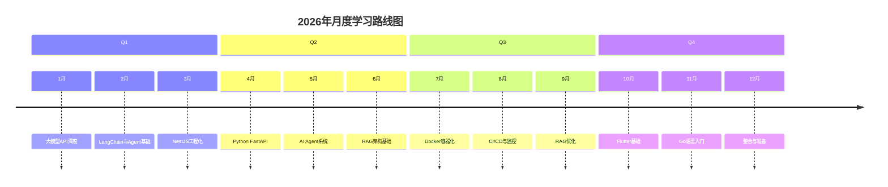

# 2026年全栈成长开发规划—月维度

## 📅 月度规划总览

本文是2026年全栈成长规划的月度详细版本，将季度目标分解为每个月的具体行动，包含每周任务、学习资源、进度评估和产出指标。

---

## 📋 1月：大模型API深度

### 月度目标
- ✅ 熟练调用OpenAI、Claude、Gemini三种API
- ✅ 理解各模型的特点和适用场景
- ✅ 完成智能问答系统MVP
- ✅ 技术博客1篇

### 技术重点

#### 第1周：OpenAI API全面掌握
**学习任务**：
- [ ] 完成OpenAI官方教程（ChatGPT API）
- [ ] 实践Function Calling功能
- [ ] 掌握API错误处理
- [ ] 实现简单的对话应用

**学习资源**：
- OpenAI官方文档：https://platform.openai.com/docs
- OpenAI API Quickstart
- Function Calling指南

**实践产出**：
- 代码：简单对话应用（50-100行）
- 文档：API调用最佳实践笔记
- 测试：3种不同场景的API调用

#### 第2周：Claude API深度学习
**学习任务**：
- [ ] Claude 3.5 Sonnet API调用
- [ ] 理解Claude的上下文管理
- [ ] 实践长文本处理
- [ ] 对比OpenAI与Claude差异

**学习资源**：
- Anthropic Claude API文档
- Claude最佳实践指南
- Claude API限制说明

**实践产出**：
- 代码：Claude对话应用
- 文档：Claude vs OpenAI对比分析
- 测试：长文本场景测试

#### 第3周：Gemini API探索
**学习任务**：
- [ ] Gemini 1.5 Pro API调用
- [ ] 了解Gemini的多模态能力
- [ ] 实践图像理解功能
- [ ] 对比三种API优劣

**学习资源**：
- Google AI Studio文档
- Gemini API教程
- 多模态实践案例

**实践产出**：
- 代码：多模态应用
- 文档：三种API综合对比
- 测试：图文混合场景

#### 第4周：智能问答系统MVP
**学习任务**：
- [ ] 整合三种API的问答系统
- [ ] 实现API切换功能
- [ ] 添加对话历史管理
- [ ] 完成基础UI界面

**实践产出**：
- 项目：智能问答系统MVP
- 文档：项目README
- 技术博客：《大模型API调用实战总结》

### 进度评估标准

#### 技术掌握度评估
- [ ] 能独立调用三种API（90分以上）
- [ ] 理解各模型特点（85分以上）
- [ ] 能处理API常见错误（80分以上）
- [ ] 能选择合适的模型（85分以上）

#### 项目完成度评估
- [ ] 智能问答系统功能完整（90%以上）
- [ ] 代码质量良好（80分以上）
- [ ] 文档完善（85分以上）
- [ ] UI可用（70分以上）

### 产出指标
- ✅ 代码：300+行高质量代码
- ✅ 文档：API调用最佳实践
- ✅ 项目：1个完整MVP
- ✅ 博客：1篇技术文章

---

## 📋 2月：LangChain与Agent基础

### 月度目标
- ✅ 掌握LangChain核心概念
- ✅ 完成LangChain基础项目
- ✅ 理解Agent基本原理
- ✅ 技术博客1篇

### 技术重点

#### 第1周：LangChain核心概念
**学习任务**：
- [ ] LangChain框架架构理解
- [ ] Chains基础使用
- [ ] Prompt Templates实践
- [ ] Memory机制学习

**学习资源**：
- LangChain官方文档
- LangChain Quickstart
- Prompt Engineering指南

**实践产出**：
- 代码：简单的Chain实现
- 文档：LangChain学习笔记
- 练习：5种不同Chain类型

#### 第2周：Tools与Agents基础
**学习任务**：
- [ ] Tools概念与实现
- [ ] Agents基础使用
- [ ] Tool Calling实践
- [ ] 简单Agent搭建

**学习资源**：
- LangChain Agents文档
- Tools使用指南
- Agent实践案例

**实践产出**：
- 代码：自定义Tool实现
- 文档：Tool开发经验
- 项目：简单Agent系统

#### 第3周：文档检索Agent
**学习任务**：
- [ ] 文档加载与分割
- [ ] 向量存储基础
- [ ] 检索优化实践
- [ ] 文档问答系统

**实践产出**：
- 项目：文档检索问答系统
- 文档：向量存储对比
- 测试：不同文档类型测试

#### 第4周：Agent系统整合
**学习任务**：
- [ ] 多Agent协作基础
- [ ] 任务拆解实践
- [ ] 自我迭代机制
- [ ] 完整Agent系统

**实践产出**：
- 项目：完整Agent系统
- 文档：系统架构图
- 技术博客：《LangChain Agent实战》

### 进度评估标准
- [ ] LangChain核心概念掌握（90分以上）
- [ ] 能独立搭建Agent系统（85分以上）
- [ ] 理解向量存储基础（80分以上）
- [ ] 文档问答系统功能完整（85分以上）

### 产出指标
- ✅ 代码：500+行
- ✅ 项目：2个完整系统
- ✅ 文档：系统架构与设计
- ✅ 博客：1篇

---

## 📋 3月：NestJS工程化

### 月度目标
- ✅ NestJS微服务架构掌握
- ✅ 高并发API设计能力
- ✅ 性能优化实践
- ✅ 技术博客1篇

### 技术重点

#### 第1周：NestJS微服务基础
**学习任务**：
- [ ] 微服务架构原理
- [ ] NestJS微服务模块
- [ ] 服务间通信
- [ ] API网关设计

**实践产出**：
- 项目：微服务架构demo
- 文档：架构设计文档

#### 第2周：消息队列集成
**学习任务**：
- [ ] RabbitMQ基础
- [ ] 消息队列集成
- [ ] 异步处理实践
- [ ] 消息可靠性

**实践产出**：
- 代码：消息队列集成
- 文档：消息队列最佳实践

#### 第3周：性能监控与优化
**学习任务**：
- [ ] APM工具使用
- [ ] 性能监控实现
- [ ] 数据库优化
- [ ] 缓存策略

**实践产出**：
- 代码：监控系统实现
- 文档：性能优化方案

#### 第4周：高并发系统实践
**学习任务**：
- [ ] 并发控制实现
- [ ] 负载均衡配置
- [ ] 压力测试实践
- [ ] 系统优化

**实践产出**：
- 项目：高并发API系统
- 文档：系统设计文档
- 技术博客：《NestJS高并发实践》

### 进度评估标准
- [ ] 微服务架构理解（85分以上）
- [ ] 消息队列掌握（80分以上）
- [ ] 性能优化能力（85分以上）
- [ ] 高并发系统设计（80分以上）

### 产出指标
- ✅ 代码：600+行
- ✅ 项目：1个完整系统
- ✅ 文档：架构与优化方案
- ✅ 博客：1篇

---

## 📋 4月：Python FastAPI

### 月度目标
- ✅ FastAPI框架深度掌握
- ✅ 异步编程实践
- ✅ 与NestJS对比学习
- ✅ 技术博客1篇

### 技术重点

#### 第1周：FastAPI基础
**学习任务**：
- [ ] FastAPI快速入门
- [ ] 路由与参数处理
- [ ] 请求验证
- [ ] 响应模型

**实践产出**：
- 代码：基础API服务
- 文档：FastAPI学习笔记

#### 第2周：异步编程
**学习任务**：
- [ ] async/await深度
- [ ] 异步数据库操作
- [ ] 并发处理实践
- [ ] 性能对比

**实践产出**：
- 代码：异步API实现
- 文档：异步编程总结

#### 第3周：数据库集成
**学习任务**：
- [ ] SQLAlchemy集成
- [ ] ORM最佳实践
- [ ] 数据库优化
- [ ] 事务处理

**实践产出**：
- 代码：数据库集成
- 文档：数据库设计

#### 第4周：性能优化与对比
**学习任务**：
- [ ] Python性能优化
- [ ] 与Node.js性能对比
- [ ] 最佳实践总结
- [ ] 完整项目

**实践产出**：
- 项目：Python后端服务
- 文档：技术对比报告
- 技术博客：《FastAPI vs NestJS》

### 进度评估标准
- [ ] FastAPI掌握（90分以上）
- [ ] 异步编程理解（85分以上）
- [ ] 数据库操作（80分以上）
- [ ] 性能优化（85分以上）

### 产出指标
- ✅ 代码：500+行
- ✅ 项目：1个完整服务
- ✅ 文档：对比分析
- ✅ 博客：1篇

---

## 📋 5月：AI Agent系统

### 月度目标
- ✅ 独立搭建AI Agent系统
- ✅ 多智能体协作实现
- ✅ 任务规划算法理解
- ✅ 技术博客1篇

### 技术重点

#### 第1周：AutoGPT源码分析
**学习任务**：
- [ ] AutoGPT架构分析
- [ ] 核心模块理解
- [ ] 任务执行机制
- [ ] 设计模式学习

**实践产出**：
- 文档：架构分析报告
- 代码：简化版AutoGPT

#### 第2周：CrewAI框架学习
**学习任务**：
- [ ] CrewAI基础概念
- [ ] Agent定义与管理
- [ ] 任务分配机制
- [ ] 协作流程设计

**实践产出**：
- 代码：CrewAI实践项目
- 文档：框架使用指南

#### 第3周：多智能体协作
**学习任务**：
- [ ] 通信机制设计
- [ ] 协作模式实现
- [ ] 冲突解决策略
- [ ] 性能优化

**实践产出**：
- 项目：多Agent协作系统
- 文档：协作机制设计

#### 第4周：AI助理MVP
**学习任务**：
- [ ] 整合所有功能
- [ ] 用户界面实现
- [ ] 数据持久化
- [ ] 系统测试

**实践产出**：
- 项目：AI助理MVP完整版
- 文档：系统设计文档
- 技术博客：《AI Agent系统实战》

### 进度评估标准
- [ ] Agent系统理解（90分以上）
- [ ] 多智能体协作（85分以上）
- [ ] 系统设计能力（85分以上）
- [ ] 项目完成度（90分以上）

### 产出指标
- ✅ 代码：800+行
- ✅ 项目：1个完整系统
- ✅ 文档：完整设计文档
- ✅ 博客：1篇

---

## 📋 6月：RAG架构基础

### 月度目标
- ✅ 向量数据库掌握
- ✅ 文档嵌入与存储
- ✅ 检索策略实现
- ✅ 技术博客1篇

### 技术重点

#### 第1周：向量数据库基础
**学习任务**：
- [ ] 向量数据库原理
- [ ] Pinecone使用
- [ ] Milvus基础
- [ ] 性能对比

**实践产出**：
- 代码：向量数据库连接
- 文档：向量存储对比

#### 第2周：文档嵌入与存储
**学习任务**：
- [ ] 文档处理流程
- [ ] Embedding API使用
- [ ] 向量化策略
- [ ] 存储优化

**实践产出**：
- 代码：文档嵌入实现
- 文档：嵌入策略文档

#### 第3周：检索策略实现
**学习任务**：
- [ ] 相似度检索
- [ ] 混合检索
- [ ] 重排序技术
- [ ] 结果优化

**实践产出**：
- 代码：检索系统实现
- 文档：检索策略对比

#### 第4周：RAG系统整合
**学习任务**：
- [ ] 完整RAG流程
- [ ] 上下文管理
- [ ] 问答系统实现
- [ ] 性能测试

**实践产出**：
- 项目：RAG问答系统
- 文档：系统实现文档
- 技术博客：《RAG架构实战》

### 进度评估标准
- [ ] 向量数据库掌握（85分以上）
- [ ] 文档嵌入理解（85分以上）
- [ ] 检索策略实现（80分以上）
- [ ] RAG系统完成（85分以上）

### 产出指标
- ✅ 代码：600+行
- ✅ 项目：1个完整系统
- ✅ 文档：完整实现文档
- ✅ 博客：1篇

---

## 📋 7月：Docker容器化

### 月度目标
- ✅ Docker深度掌握
- ✅ 容器化最佳实践
- ✅ 多服务编排
- ✅ 技术博客1篇

### 技术重点

#### 第1周：Docker基础深化
**学习任务**：
- [ ] Dockerfile最佳实践
- [ ] 多阶段构建
- [ ] 镜像优化
- [ ] 安全配置

**实践产出**：
- 代码：优化Dockerfile
- 文档：Docker最佳实践

#### 第2周：Docker Compose
**学习任务**：
- [ ] Compose基础
- [ ] 多服务编排
- [ ] 网络配置
- [ ] 数据卷管理

**实践产出**：
- 项目：多服务容器化
- 文档：Compose配置指南

#### 第3周：生产环境配置
**学习任务**：
- [ ] 环境变量管理
- [ ] 健康检查
- [ ] 日志配置
- [ ] 监控集成

**实践产出**：
- 代码：生产环境配置
- 文档：部署指南

#### 第4周：容器化项目实践
**学习任务**：
- [ ] 完整项目容器化
- [ ] 多环境配置
- [ ] 部署自动化
- [ ] 文档完善

**实践产出**：
- 项目：完整容器化系统
- 文档：部署文档
- 技术博客：《Docker实战指南》

### 进度评估标准
- [ ] Docker掌握（90分以上）
- [ ] Compose使用（85分以上）
- [ ] 生产环境配置（85分以上）
- [ ] 容器化经验（85分以上）

### 产出指标
- ✅ 代码：400+行
- ✅ 项目：1个完整系统
- ✅ 文档：部署文档
- ✅ 博客：1篇

---

## 📋 8月：CI/CD与监控

### 月度目标
- ✅ CI/CD流水线搭建
- ✅ 自动化测试集成
- ✅ 监控告警系统
- ✅ 技术博客1篇

### 技术重点

#### 第1周：GitHub Actions基础
**学习任务**：
- [ ] Actions语法掌握
- [ ] Workflow配置
- [ ] Secret管理
- [ ] 触发器设置

**实践产出**：
- 代码：基础CI配置
- 文档：Actions使用指南

#### 第2周：自动化测试
**学习任务**：
- [ ] 单元测试
- [ ] 集成测试
- [ ] E2E测试
- [ ] 测试覆盖率

**实践产出**：
- 代码：测试套件
- 文档：测试策略文档

#### 第3周：部署自动化
**学习任务**：
- [ ] 自动部署流程
- [ ] 回滚机制
- [ ] 环境管理
- [ ] 版本控制

**实践产出**：
- 代码：自动化部署脚本
- 文档：部署流程文档

#### 第4周：监控告警
**学习任务**：
- [ ] 日志收集
- [ ] 性能监控
- [ ] 告警配置
- [ ] 可视化

**实践产出**：
- 项目：监控系统
- 文档：监控指南
- 技术博客：《CI/CD实战》

### 进度评估标准
- [ ] CI/CD掌握（85分以上）
- [ ] 自动化测试（80分以上）
- [ ] 监控告警（85分以上）
- [ ] 完整流水线（85分以上）

### 产出指标
- ✅ 代码：500+行
- ✅ 项目：1个完整系统
- ✅ 文档：CI/CD文档
- ✅ 博客：1篇

---

## 📋 9月：RAG优化

### 月度目标
- ✅ RAG性能优化
- ✅ 检索策略优化
- ✅ 知识混淆解决
- ✅ 技术博客1篇

### 技术重点

#### 第1周：检索策略优化
**学习任务**：
- [ ] 混合检索策略
- [ ] 重排序算法
- [ ] 查询扩展
- [ ] 结果缓存

**实践产出**：
- 代码：优化检索系统
- 文档：优化策略文档

#### 第2周：知识混淆解决
**学习任务**：
- [ ] 混淆原因分析
- [ ] 解决方案设计
- [ ] 测试验证
- [ ] 效果评估

**实践产出**：
- 代码：混淆解决实现
- 文档：问题分析报告

#### 第3周：性能调优
**学习任务**：
- [ ] 查询性能优化
- [ ] 内存优化
- [ ] 并发处理
- [ ] 缓存策略

**实践产出**：
- 代码：性能优化
- 文档：性能报告

#### 第4周：生产级RAG
**学习任务**：
- [ ] 系统整合
- [ ] 压力测试
- [ ] 稳定性优化
- [ ] 文档完善

**实践产出**：
- 项目：生产级RAG系统
- 文档：系统文档
- 技术博客：《RAG优化实战》

### 进度评估标准
- [ ] 检索优化（85分以上）
- [ ] 混淆解决（85分以上）
- [ ] 性能优化（85分以上）
- [ ] 生产级系统（85分以上）

### 产出指标
- ✅ 代码：600+行
- ✅ 项目：1个生产系统
- ✅ 文档：完整文档
- ✅ 博客：1篇

---

## 📋 10月：Flutter基础

### 月度目标
- ✅ Dart语言掌握
- ✅ Flutter UI开发
- ✅ 状态管理实践
- ✅ 技术博客1篇

### 技术重点

#### 第1周：Dart语言基础
**学习任务**：
- [ ] Dart语法基础
- [ ] 异步编程
- [ ] 面向对象
- [ ] 类型系统

**实践产出**：
- 代码：Dart练习
- 文档：Dart学习笔记

#### 第2周：Flutter UI基础
**学习任务**：
- [ ] Widgets系统
- [ ] 布局管理
- [ ] 样式定制
- [ ] 交互处理

**实践产出**：
- 代码：Flutter UI实现
- 文档：UI开发指南

#### 第3周：状态管理
**学习任务**：
- [ ] Provider使用
- [ ] Riverpod实践
- [ ] 状态管理最佳实践
- [ ] 性能优化

**实践产出**：
- 代码：状态管理实现
- 文档：状态管理对比

#### 第4周：移动端App
**学习任务**：
- [ ] 完整App开发
- [ ] API集成
- [ ] 本地存储
- [ ] 发布准备

**实践产出**：
- 项目：Flutter移动端App
- 文档：开发文档
- 技术博客：《Flutter入门实战》

### 进度评估标准
- [ ] Dart语言（85分以上）
- [ ] Flutter UI（85分以上）
- [ ] 状态管理（80分以上）
- [ ] App开发（85分以上）

### 产出指标
- ✅ 代码：700+行
- ✅ 项目：1个移动App
- ✅ 文档：开发文档
- ✅ 博客：1篇

---

## 📋 11月：Go语言入门

### 月度目标
- ✅ Go语言基础掌握
- ✅ Web服务开发
- ✅ 并发编程实践
- ✅ 技术博客1篇

### 技术重点

#### 第1周：Go语言基础
**学习任务**：
- [ ] Go语法基础
- [ ] 数据结构
- [ ] 函数与方法
- [ ] 错误处理

**实践产出**：
- 代码：Go练习
- 文档：Go学习笔记

#### 第2周：并发编程
**学习任务**：
- [ ] Goroutine
- [ ] Channel
- [ ] 并发模式
- [ ] 同步机制

**实践产出**：
- 代码：并发程序
- 文档：并发编程总结

#### 第3周：Web服务
**学习任务**：
- [ ] HTTP服务器
- [ ] 路由处理
- [ ] 中间件
- [ ] 模板渲染

**实践产出**：
- 代码：Web服务实现
- 文档：Web服务文档

#### 第4周：实践项目
**学习任务**：
- [ ] 完整Go服务
- [ ] 数据库集成
- [ ] API设计
- [ ] 测试与部署

**实践产出**：
- 项目：Go语言后端服务
- 文档：服务文档
- 技术博客：《Go入门实战》

### 进度评估标准
- [ ] Go语言基础（80分以上）
- [ ] 并发编程（80分以上）
- [ ] Web服务（80分以上）
- [ ] 项目完成（85分以上）

### 产出指标
- ✅ 代码：600+行
- ✅ 项目：1个服务
- ✅ 文档：服务文档
- ✅ 博客：1篇

---

## 📋 12月：整合与准备

### 月度目标
- ✅ 作品集整理完成
- ✅ 技术面试准备
- ✅ 英文文档撰写
- ✅ 岗位申请准备

### 技术重点

#### 第1周：作品集整理
**学习任务**：
- [ ] GitHub项目整理
- [ ] README优化
- [ ] 演示视频制作
- [ ] 作品集网站

**实践产出**：
- 项目：完整作品集
- 文档：项目说明

#### 第2周：技术面试准备
**学习任务**：
- [ ] 算法题准备
- [ ] 系统设计准备
- [ ] AI技术问答
- [ ] 模拟面试

**实践产出**：
- 文档：面试准备材料
- 练习：题库完成

#### 第3周：英文文档撰写
**学习任务**：
- [ ] 项目英文README
- [ ] 技术博客英文版
- [ ] 简历英文版
- [ ] Cover Letter

**实践产出**：
- 文档：英文文档集
- 博客：英文技术文章

#### 第4周：岗位申请准备
**学习任务**：
- [ ] 简历最终优化
- [ ] LinkedIn完善
- [ ] 作品集发布
- [ ] 岗位投递

**实践产出**：
- 文档：求职材料
- 项目：完整作品集

### 进度评估标准
- [ ] 作品集完整（95分以上）
- [ ] 面试准备（90分以上）
- [ ] 英文文档（85分以上）
- [ ] 求职准备（90分以上）

### 产出指标
- ✅ 项目：完整作品集
- ✅ 文档：求职材料
- ✅ 博客：英文文章
- ✅ 准备：岗位投递

---

## 🎯 月度进度评估标准

### 评估维度
1. **技术掌握度**：核心技术的掌握程度（0-100分）
2. **项目完成度**：月度目标的完成情况（0-100%）
3. **代码质量**：代码质量和规范（0-100分）
4. **文档完善度**：文档的完整性和质量（0-100分）

### 评分标准
- **优秀**：90分以上 / 90%以上
- **良好**：80-89分 / 80-89%
- **及格**：70-79分 / 70-79%
- **需改进**：70分以下 / 70%以下

---

## 📊 产出指标总览

### 代码产出
- **总计**：约6,000+行高质量代码
- **平均每月**：约500行
- **质量标准**：可复用、可维护、有文档

### 项目产出
- **总计**：12个完整项目
- **平均每月**：1个项目
- **质量标准**：可演示、有文档、能部署

### 文档产出
- **总计**：24+份技术文档
- **平均每月**：2份文档
- **质量标准**：详细、清晰、有示例

### 博客产出
- **总计**：12篇技术博客
- **平均每月**：1篇文章
- **质量标准**：原创、有深度、有代码

---

## 💡 月度学习建议

### 时间管理建议
1. **每周固定学习时间**：
   - 工作日：每天2小时（晚上20:00-22:00）
   - 周末：每天6小时（上午9:00-12:00，下午14:00-17:00）

2. **每周时间分配**：
   - 理论学习：20%（约5小时）
   - 代码实践：60%（约15小时）
   - 文档整理：10%（约2.5小时）
   - 复习总结：10%（约2.5小时）

### 学习方法建议
1. **项目驱动**：每月必须完成1个完整项目
2. **问题导向**：遇到问题立即记录并解决
3. **代码复用**：建立个人代码库
4. **文档沉淀**：及时总结学习经验

### 进度跟踪建议
1. **每周检查**：每周日晚检查本周进度
2. **每月回顾**：每月末进行月度回顾
3. **季度评估**：每季度末进行季度评估
4. **年度总结**：年末进行年度总结

### 质量控制建议
1. **代码审查**：定期review自己的代码
2. **测试覆盖**：重要功能必须有测试
3. **文档完善**：每个项目必须有完整文档
4. **性能测试**：重要系统必须有性能测试

---

## ✅ 月度检查清单总览

### 每月必做
- [ ] 完成月度学习目标
- [ ] 完成1个完整项目
- [ ] 写1篇技术博客
- [ ] 进行月度总结

### 每周必做
- [ ] 完成周学习任务
- [ ] 提交代码到GitHub
- [ ] 更新学习笔记
- [ ] 检查学习进度

### 每日必做
- [ ] 学习2小时（工作日）
- [ ] 记录学习笔记
- [ ] 复习前一天内容
- [ ] 规划明天学习

---

## 🎯 总结

2026年的12个月是一个完整的学习旅程：

- **Q1（1-3月）**：建立AI技术基础
- **Q2（4-6月）**：搭建AI Agent系统
- **Q3（7-9月）**：掌握DevOps能力
- **Q4（10-12月）**：完成岗位准备

每个月都有明确的目标、具体的任务、可评估的标准和可量化的产出。严格按照这个计划执行，2026年底一定能够实现目标，胜任AI Agent全栈工程师岗位。

> 12个月的学习之旅已经开始。保持耐心，持续努力，每月都有进步，2026年底我们一定能够成功！ 🚀

---

**系列文章总结**：
- 第1篇：岗位分析与差距评估
- 第2篇：季度详细规划
- 第3篇：月度行动计划

三篇文章构成了一个完整的2026年学习规划体系，从宏观到微观，从理论到实践，为全栈转型之路提供了清晰的路线图。祝学习顺利，早日实现职业目标！ ✨