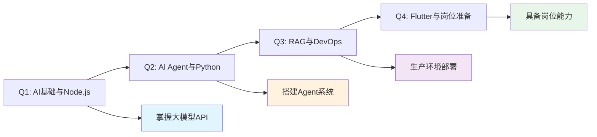

# 2026年全栈成长开发规划—季维度

## 📅 季度规划总览

基于上一篇的岗位分析与差距评估，本文制定2026年四个季度的详细学习计划，目标是在Q4结束时具备胜任12-24K AI Agent全栈工程师岗位的能力。

## 🎯 季度核心目标

### Q1 (1-3月)：AI基础与Node.js后端深化
**目标定位**：建立AI技术基础，强化Node.js工程化能力

### Q2 (4-6月)：AI Agent系统与Python扩展
**目标定位**：独立搭建AI Agent系统，扩展Python后端能力

### Q3 (7-9月)：RAG架构与DevOps实战
**目标定位**：掌握RAG架构优化，具备生产环境部署能力

### Q4 (10-12月)：Flutter跨端与岗位准备
**目标定位**：Flutter跨端开发，完成岗位胜任力准备

---

## 📋 Q1 (1-3月)：AI基础与Node.js后端深化

### 季度目标
- ✅ 熟练掌握3种以上大模型API调用
- ✅ 完成LangChain基础项目
- ✅ NestJS高并发服务经验
- ✅ 完成2个AI相关后端项目

### 技术重点

#### 1. 大模型API深度掌握
**学习内容**：
- OpenAI API全功能（ChatGPT、Embeddings、Function Calling）
- Anthropic Claude API（Claude 3.5 Sonnet、Opus）
- Google Gemini API（Gemini 1.5 Pro）

**实践项目**：
- 智能问答系统（支持多模型切换）
- 文档总结工具
- 代码生成助手

**学习资源**：
- OpenAI官方文档：https://platform.openai.com/docs
- Anthropic Claude API指南
- Google AI Studio文档

#### 2. LangChain与Agent基础
**学习内容**：
- LangChain核心概念（Chains、Agents、Tools）
- Prompt模板管理
- 工具调用实现
- 简单Agent搭建

**实践项目**：
- 文档检索问答系统
- 数据分析Agent
- 自动化任务执行工具

**学习资源**：
- LangChain官方教程：https://python.langchain.com/docs/get_started/introduction
- LangChain实战案例
- YouTube LangChain教程系列

#### 3. NestJS工程化深化
**学习内容**：
- 微服务架构设计
- 消息队列集成
- 性能监控与优化
- 分布式事务处理

**实践项目**：
- API网关系统
- 微服务演示项目
- 高并发聊天系统

**学习资源**：
- NestJS官方文档：https://docs.nestjs.com
- NestJS微服务实战教程
- TypeScript高级特性

### 关键能力培养计划

#### AI技术应用能力
**培养目标**：能够独立完成AI功能的集成与优化

**具体措施**：
- 每周完成1个AI API调用练习
- 阅读2篇AI应用最佳实践文章
- 参与1个AI开源项目Issue讨论

**评估标准**：
- [ ] 能熟练调用3种以上大模型API
- [ ] 理解各模型的特点和适用场景
- [ ] 能处理API调用的常见错误

#### 后端工程化能力
**培养目标**：掌握高并发后端服务设计与开发

**具体措施**：
- 深入学习NestJS高级特性
- 实践性能优化技巧
- 学习分布式系统设计原则

**评估标准**：
- [ ] 能设计高并发API架构
- [ ] 掌握数据库性能优化
- [ ] 理解分布式系统基本概念

### 岗位胜任力映射

| 岗位要求 | Q1培养计划 | 完成度目标 |
|----------|-----------|----------|
| 精通LLM API调用 | 3种主流API深度学习 | 100% |
| Prompt工程基础 | LangChain实践 | 80% |
| Node.js高并发 | NestJS微服务项目 | 70% |
| AI Agent概念 | LangChain Agent基础 | 60% |

### 进度评估标准

#### 第1月评估
**应达到能力**：
- [ ] 熟练调用OpenAI API
- [ ] 理解LangChain核心概念
- [ ] 完成简单LangChain项目

**项目产出**：
- 智能问答系统MVP
- LangChain学习笔记
- API调用最佳实践文档

#### 第2月评估
**应达到能力**：
- [ ] 掌握多模型API调用
- [ ] NestJS微服务基础
- [ ] 性能优化初步实践

**项目产出**：
- 多模型切换系统
- 微服务演示项目
- 性能优化报告

#### 第3月评估
**应达到能力**：
- [ ] 独立完成AI功能集成
- [ ] 高并发API设计能力
- [ ] 完整项目开发经验

**项目产出**：
- AI Agent基础系统
- 完整后端服务项目
- 技术博客（1-2篇）

### 检查清单

#### AI技术
- [ ] OpenAI API熟练调用
- [ ] Claude API熟练调用
- [ ] Gemini API熟练调用
- [ ] LangChain核心概念掌握
- [ ] Agent基础搭建能力
- [ ] Prompt工程实践

#### 后端技术
- [ ] NestJS微服务架构
- [ ] 消息队列集成
- [ ] 性能监控实施
- [ ] 数据库优化实践
- [ ] 高并发设计经验

#### 项目经验
- [ ] 完成智能问答系统
- [ ] 完成AI Agent基础系统
- [ ] 完成微服务项目
- [ ] 技术博客发布

---

## 📋 Q2 (4-6月)：AI Agent系统与Python扩展

### 季度目标
- ✅ 独立搭建AI Agent系统
- ✅ Python FastAPI项目经验
- ✅ 基础RAG实现
- ✅ 完成AI助理MVP

### 技术重点

#### 1. AI Agent系统深度
**学习内容**：
- AutoGPT源码分析
- CrewAI框架学习
- 多智能体协作实现
- 任务规划与执行机制

**实践项目**：
- 自主任务执行Agent
- 多Agent协作系统
- 自我迭代Agent

**学习资源**：
- AutoGPT GitHub仓库
- CrewAI官方文档
- Agent设计最佳实践

#### 2. Python FastAPI深度
**学习内容**：
- FastAPI框架深度掌握
- 异步编程优化
- 与NestJS对比实践
- Python性能优化

**实践项目**：
- 用Python重写简单API
- Python后端服务
- Python-Node.js混合架构

**学习资源**：
- FastAPI官方文档：https://fastapi.tiangolo.com
- Python异步编程教程
- Python性能优化指南

#### 3. RAG架构基础
**学习内容**：
- 向量数据库基础
- 文档嵌入与存储
- 检索策略实现
- 上下文管理

**实践项目**：
- 文档检索系统
- 知识库问答系统
- RAG基础实现

**学习资源**：
- Pinecone官方文档
- Milvus向量数据库教程
- RAG最佳实践

### 关键能力培养计划

#### AI Agent系统设计能力
**培养目标**：能够独立设计并搭建复杂AI Agent系统

**具体措施**：
- 深入研究开源Agent框架
- 实践多智能体协作场景
- 学习任务规划算法

**评估标准**：
- [ ] 理解Agent系统架构
- [ ] 能设计多智能体协作
- [ ] 掌握任务拆解方法

#### Python后端开发能力
**培养目标**：具备生产级Python后端开发能力

**具体措施**：
- 深度学习FastAPI框架
- 实践异步编程模式
- 对比Node.js与Python性能

**评估标准**：
- [ ] 能独立开发Python API
- [ ] 理解异步编程优势
- [ ] 掌握Python性能优化

### 岗位胜任力映射

| 岗位要求 | Q2培养计划 | 完成度目标 |
|----------|-----------|----------|
| 独立搭建Agent系统 | AutoGPT/CrewAI实践 | 90% |
| Python后端开发 | FastAPI深度学习 | 80% |
| 多智能体协作 | 实践项目实现 | 70% |
| RAG架构基础 | 向量数据库学习 | 60% |

### 进度评估标准

#### 第4月评估
**应达到能力**：
- [ ] 理解AI Agent架构
- [ ] 掌握Python FastAPI基础
- [ ] 了解向量数据库概念

**项目产出**：
- Agent系统设计文档
- Python API服务
- 向量数据库学习笔记

#### 第5月评估
**应达到能力**：
- [ ] 能搭建基础Agent系统
- [ ] Python异步编程掌握
- [ ] RAG基础实现

**项目产出**：
- 多智能体协作系统
- RAG检索系统
- 技术对比分析文章

#### 第6月评估
**应达到能力**：
- [ ] 独立设计Agent架构
- [ ] Python生产级开发能力
- [ ] RAG系统优化能力

**项目产出**：
- AI助理MVP完整版
- Python后端服务
- 技术博客（2-3篇）

### 检查清单

#### AI Agent技术
- [ ] Agent架构设计能力
- [ ] 多智能体协作实现
- [ ] 任务规划算法理解
- [ ] 自我迭代机制实现
- [ ] 工具调用优化

#### Python技术
- [ ] FastAPI深度掌握
- [ ] 异步编程实践
- [ ] 性能优化经验
- [ ] 与Node.js对比
- [ ] 生产级代码规范

#### RAG技术
- [ ] 向量数据库选型
- [ ] 文档嵌入实现
- [ ] 检索策略优化
- [ ] 上下文管理
- [ ] 性能调优

---

## 📋 Q3 (7-9月)：RAG架构与DevOps实战

### 季度目标
- ✅ 生产环境容器化部署
- ✅ CI/CD流水线搭建
- ✅ RAG架构优化经验
- ✅ 监控与运维能力

### 技术重点

#### 1. RAG架构优化
**学习内容**：
- 检索策略深度优化
- 知识混淆解决方案
- 多轮对话上下文管理
- 性能调优技巧

**实践项目**：
- 企业级知识库系统
- 智能客服系统
- RAG性能优化工具

**学习资源**：
- Pinecone高级教程
- Milvus性能优化指南
- RAG前沿论文

#### 2. Docker容器化深度
**学习内容**：
- Docker多阶段构建
- Docker Compose编排
- 容器网络与存储
- 生产环境配置

**实践项目**：
- 微服务容器化
- 完整应用容器化
- 多环境部署配置

**学习资源**：
- Docker官方文档：https://docs.docker.com
- Kubernetes基础教程
- 容器化最佳实践

#### 3. CI/CD流水线
**学习内容**：
- GitHub Actions配置
- 自动化测试集成
- 部署自动化
- 版本管理策略

**实践项目**：
- 完整CI/CD流水线
- 多环境部署流程
- 自动化回滚机制

**学习资源**：
- GitHub Actions文档
- CI/CD最佳实践
- DevOps基础教程

### 关键能力培养计划

#### RAG架构优化能力
**培养目标**：能够优化RAG系统性能和准确率

**具体措施**：
- 深入研究检索算法
- 实践知识库构建
- 优化嵌入模型选择

**评估标准**：
- [ ] 能优化检索策略
- [ ] 解决知识混淆问题
- [ ] 提升RAG准确率

#### DevOps工程化能力
**培养目标**：掌握生产环境部署与运维

**具体措施**：
- 深度学习Docker/K8s
- 实践CI/CD流水线
- 学习监控与日志

**评估标准**：
- [ ] 能独立部署生产环境
- [ ] 搭建完整CI/CD
- [ ] 掌握监控运维

### 岗位胜任力映射

| 岗位要求 | Q3培养计划 | 完成度目标 |
|----------|-----------|----------|
| RAG架构优化 | 深度优化实践 | 85% |
| Docker容器化 | 生产环境部署 | 90% |
| CI/CD流水线 | 完整流水线搭建 | 95% |
| 监控运维 | 生产环境管理 | 80% |

### 进度评估标准

#### 第7月评估
**应达到能力**：
- [ ] 理解RAG优化原理
- [ ] 掌握Docker基础
- [ ] 了解CI/CD概念

**项目产出**：
- RAG优化方案
- 容器化配置文档
- CI/CD设计文档

#### 第8月评估
**应达到能力**：
- [ ] 能优化RAG性能
- [ ] Docker多服务编排
- [ ] CI/CD基础实现

**项目产出**：
- RAG优化工具
- 微服务容器化
- CI/CD流水线MVP

#### 第9月评估
**应达到能力**：
- [ ] RAG生产级优化
- [ ] K8s基础掌握
- [ ] 完整DevOps能力

**项目产出**：
- 生产级RAG系统
- 完整CI/CD流水线
- 技术博客（2-3篇）

### 检查清单

#### RAG优化
- [ ] 检索策略优化
- [ ] 知识混淆解决
- [ ] 性能调优经验
- [ ] 多轮对话管理
- [ ] 准确率提升

#### 容器化部署
- [ ] Docker深度掌握
- [ ] Compose编排
- [ ] K8s基础
- [ ] 生产环境配置
- [ ] 多环境部署

#### CI/CD
- [ ] GitHub Actions配置
- [ ] 自动化测试
- [ ] 部署自动化
- [ ] 监控告警
- [ ] 日志管理

---

## 📋 Q4 (10-12月)：Flutter跨端与岗位准备

### 季度目标
- ✅ Flutter跨端开发能力
- ✅ Go语言基础掌握
- ✅ 完整作品集准备
- ✅ 技术面试准备

### 技术重点

#### 1. Flutter跨端开发
**学习内容**：
- Dart语言基础
- Flutter UI框架
- 状态管理（Provider/Riverpod）
- 与后端API集成

**实践项目**：
- 移动端AI助理App
- 跨平台工具应用
- Flutter前后端集成

**学习资源**：
- Flutter官方文档：https://flutter.dev/docs
- Dart语言教程
- Flutter实战项目

#### 2. Go语言基础
**学习内容**：
- Go语言基础语法
- 并发编程
- Web服务开发
- 与Python/Node.js对比

**实践项目**：
- Go语言后端服务
- 并发处理工具
- 多语言系统集成

**学习资源**：
- Go语言官方教程：https://go.dev/tour
- Go Web编程
- Go并发编程

#### 3. 岗位准备
**学习内容**：
- 技术面试准备
- 项目作品集整理
- 远程工作能力培养
- 英文技术文档撰写

**实践准备**：
- 完整GitHub作品集
- 技术博客系列
- 面试题库准备
- 英文README编写

### 关键能力培养计划

#### 跨端开发能力
**培养目标**：具备Flutter跨平台应用开发能力

**具体措施**：
- 系统学习Dart语言
- 实践Flutter UI开发
- 学习状态管理方案

**评估标准**：
- [ ] 能独立开发Flutter应用
- [ ] 理解跨平台原理
- [ ] 掌握性能优化

#### 岗位胜任力准备
**培养目标**：具备应聘AI Agent全栈工程师岗位的能力

**具体措施**：
- 整理完整作品集
- 准备技术面试
- 提升英文能力

**评估标准**：
- [ ] 作品集完整
- [ ] 面试准备充分
- [ ] 技术文档完善

### 岗位胜任力映射

| 岗位要求 | Q4培养计划 | 完成度目标 |
|----------|-----------|----------|
| Flutter跨端开发 | 移动端App开发 | 85% |
| Go语言基础 | Web服务实践 | 70% |
| 岗位准备 | 完整作品集 | 100% |
| 远程工作能力 | 异步沟通实践 | 90% |

### 进度评估标准

#### 第10月评估
**应达到能力**：
- [ ] Dart语言基础掌握
- [ ] Flutter UI开发能力
- [ ] Go语言入门

**项目产出**：
- Flutter移动端MVP
- Go语言学习笔记
- 跨端开发经验

#### 第11月评估
**应达到能力**：
- [ ] Flutter完整应用
- [ ] Go语言Web服务
- [ ] 作品集框架搭建

**项目产出**：
- 移动端AI助理App
- Go语言后端服务
- 作品集初版

#### 第12月评估
**应达到能力**：
- [ ] 完整跨端开发能力
- [ ] 岗位胜任力达标
- [ ] 具备应聘能力

**项目产出**：
- 完整作品集
- 技术博客系列
- 求职准备文档

### 检查清单

#### Flutter技术
- [ ] Dart语言掌握
- [ ] Flutter UI开发
- [ ] 状态管理实践
- [ ] API集成
- [ ] 性能优化

#### Go语言
- [ ] 基础语法掌握
- [ ] 并发编程
- [ ] Web服务开发
- [ ] 与其他语言对比
- [ ] 最佳实践

#### 岗位准备
- [ ] GitHub作品集完善
- [ ] 技术博客系列
- [ ] 面试题库准备
- [ ] 英文文档撰写
- [ ] 远程工作能力

---

## 🎯 季度关键能力培养计划总结

### AI技术能力培养
**Q1-Q2重点**：
- 大模型API深度掌握
- AI Agent系统设计
- RAG架构基础实现

**Q3-Q4重点**：
- RAG架构优化
- 生产环境应用
- 复杂场景解决

### 全栈开发能力培养
**Q1重点**：Node.js深度
**Q2重点**：Python扩展
**Q4重点**：Flutter跨端 + Go语言

### 工程化能力培养
**Q3重点**：容器化 + CI/CD
**Q4重点**：生产环境运维

---

## 📊 季度进度评估标准

### 季度评估维度
1. **技术掌握度**：核心技术的掌握程度
2. **项目完成度**：季度计划的完成情况
3. **能力提升度**：实际能力的提升幅度
4. **产出丰富度**：项目、博客、开源贡献

### 评估标准
- **优秀**：100%完成，有额外产出
- **良好**：80%以上完成，质量达标
- **及格**：60%以上完成，基本达标
- **需改进**：60%以下完成，需要调整

---

## ✅ 季度检查清单总览

### Q1检查清单
- [ ] AI基础能力建立
- [ ] Node.js工程化能力提升
- [ ] 2个AI项目完成
- [ ] 技术博客（1-2篇）

### Q2检查清单
- [ ] AI Agent系统搭建
- [ ] Python后端能力
- [ ] AI助理MVP完成
- [ ] 技术博客（2-3篇）

### Q3检查清单
- [ ] RAG架构优化
- [ ] DevOps能力建立
- [ ] 生产环境部署
- [ ] 技术博客（2-3篇）

### Q4检查清单
- [ ] Flutter跨端开发
- [ ] Go语言基础
- [ ] 完整作品集
- [ ] 岗位准备完成

---

## 💡 季度学习建议

### 时间管理建议
1. **每周固定学习时间**：至少20小时
2. **周末集中实践**：每周六项目开发
3. **工作日碎片时间**：通勤、午休学习理论

### 学习方法建议
1. **项目驱动学习**：每个技术点都要有项目产出
2. **理论与实践结合**：70%实践 + 30%理论
3. **社区参与**：加入技术社区，获取反馈

### 风险管理建议
1. **技术债务控制**：定期重构，保持代码质量
2. **学习倦怠预防**：设定小目标，及时奖励
3. **计划灵活调整**：根据实际情况调整学习节奏

### 效率提升建议
1. **AI工具辅助**：使用Cursor/GitHub Copilot提升效率
2. **代码复用**：建立个人代码库
3. **文档沉淀**：及时总结学习经验

---

## 🎯 总结

2026年的四个季度将是一个完整的学习旅程：

- **Q1**：建立AI基础，强化Node.js能力
- **Q2**：搭建AI Agent系统，扩展Python能力
- **Q3**：优化RAG架构，掌握DevOps能力
- **Q4**：Flutter跨端开发，完成岗位准备

每个季度都有明确的目标、技术重点、评估标准和检查清单。严格按照这个规划执行，Q4结束时将具备胜任AI Agent全栈工程师岗位的能力。

> 学习之路充满挑战，但每个季度都是一次成长。保持耐心，持续努力，2026年底我们一定能实现目标！ 🚀

---

**下一篇预告**：《2026年全栈成长开发规划—月维度》将详细制定每月的具体行动计划、学习资源和产出指标，敬请期待！